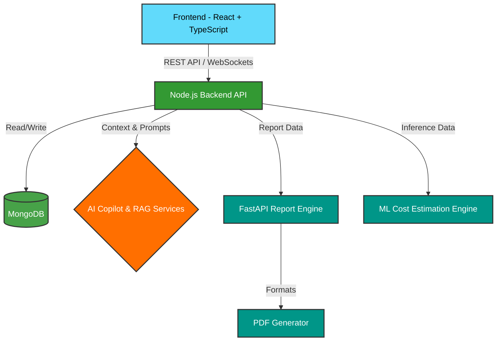

<div align="center">
  

  <h3>AI-Powered Construction Intelligence Platform</h3>
  <p><em>Plan • Monitor • Collaborate • Predict — All in one ecosystem.</em></p>

  <p>
    
    
    
    
    
    
  </p>
</div>

---

## 🌟 The Future of Construction is Here

> **“Sanrachna”** *(संरचना)* is derived from Sanskrit and represents **structure, architecture, and intelligent construction systems**.

Construction projects are notoriously complex, often plagued by fragmented communication, manual reporting, delayed decision-making, and disconnected tools. **Sanrachna changes everything.** 

Built to bridge the operational gap between project owners, engineers, supervisors, and on-site workers, Sanrachna transforms traditional workflows through **intelligent automation, centralized collaboration, predictive analytics, and AI-driven project assistance.**

Whether you're managing a single building or a massive infrastructure project, Sanrachna is your ultimate construction intelligence partner.

---

## ✨ Why Sanrachna? The "Wow" Factor

| 🧠 **AI-Assisted Planning** | 📊 **Real-Time Execution** | 💰 **Predictive Analytics** |
| :--- | :--- | :--- |
| Generate complete execution plans with our AI Studio. Automatic task breakdowns, milestones, and context-aware insights powered by **Groq** and **RAG**. | Monitor live health indicators, workforce utilization, and progress timelines directly from an immersive, 3D-enhanced dashboard. | Leverage built-in Machine Learning models to predict project costs, forecast budgets, and optimize resource allocation *before* execution begins. |

---

## 🚀 Key Features

### 🏗️ For the Site & Office
- **Smart Task Management:** Role-based assignment with lifecycle tracking.
- **Daily Progress Logs:** Seamless submission from workers, quick approval by engineers.
- **Workforce Coordination:** Live labor tracking and dynamic allocation.
- **Document Hub:** Centralized, version-aware repository for all blueprints and contracts.
- **Planning Studio:** Interactive timeline scheduling and project task breakdown.
- **Project Insights Dashboard:** Real-time analytics, cost tracking, and overall project health metrics.

### 🛡️ Safety & Reliability
- **Emergency Evacuation System:** One-tap SOS alerts, live muster point tracking, and automated emergency broadcasting.
- **Incident Workflows:** Severity-based classification and escalation.
- **RFI & Issue Tracking:** Threaded discussions and priority-based resolution.

### 🤖 AI & Machine Learning Capabilities
- **AI Construction Copilot:** Chat with your project data! Get context-aware answers instantly.
- **ML Cost Estimation:** Predict budgets and resource requirements using trained Machine Learning models.
- **Automated AI Reporting:** One-click PDF generation with narrative summaries and risk analysis.
- **Procurement Engine:** AI-driven material recommendations and automated RFQ creation.

---

## 🏛️ System Architecture

Sanrachna utilizes a robust, modern microservices-inspired architecture to ensure scalability and speed:



---

## 🔐 Role-Based Access Control

Sanrachna delivers tailored experiences based on user roles:
- 👑 **Owner:** High-level analytics, budget forecasting, and AI copilot.
- 👷‍♂️ **Engineer:** Task management, RFI resolution, log approvals, and document management.
- 🛠️ **Worker:** Simplified mobile-friendly interface for daily progress logs and incident reporting.

---

## ⚡ Getting Started

Ready to experience Sanrachna locally? Our ecosystem is divided into three main components:

### 1️⃣ Start the Backend (Node.js)
```bash
cd backend
npm install
npm run dev
```
*(Requires MongoDB connection string in `.env`)*

### 2️⃣ Start the Frontend (React + Vite)
```bash
cd frontend-v2
npm install
npm run dev
```

### 3️⃣ Start the AI & Report Engine (Python / FastAPI)
```bash
cd report-engine
pip install -r requirements.txt
./start_report_engine.bat
```

---

<div align="center">
  <p>Built with ❤️ to revolutionize the construction industry.</p>
  <p><strong>Copyright © 2026 Sanrachna Platform. All rights reserved.</strong><br/>
  <em>Proprietary and confidential. Unauthorized copying or distribution is strictly prohibited.</em></p>
</div>